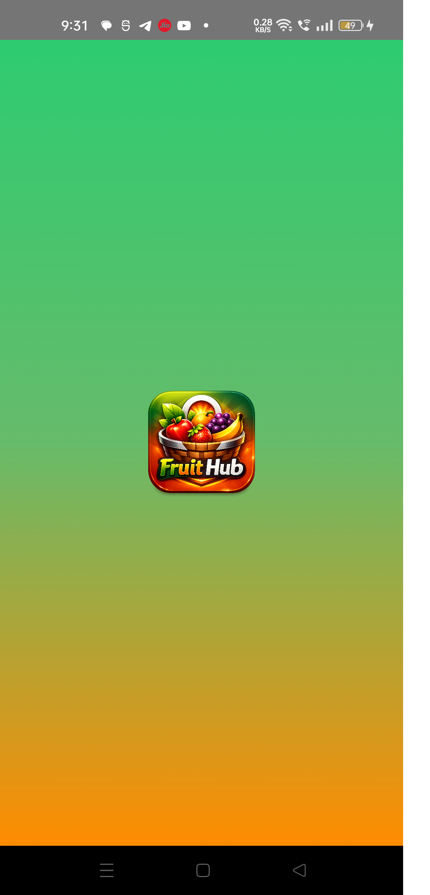
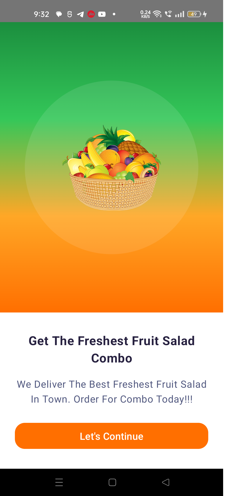
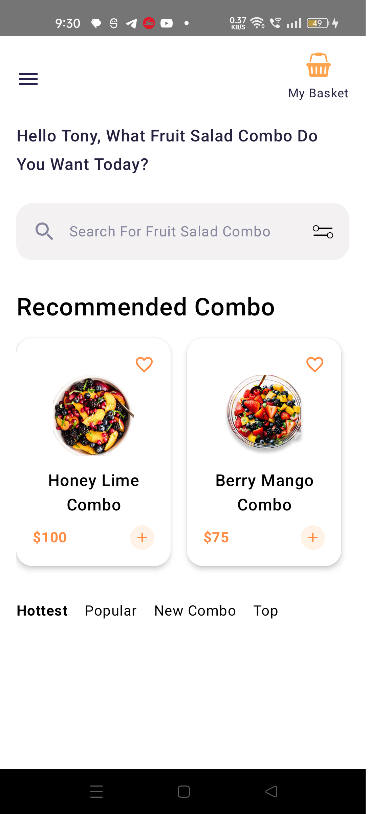

# 🍓 Fruit Hub - Jetpack Compose Android App

A modern Android application built using **Jetpack Compose** that showcases fruit salad combos with a clean UI and smooth navigation flow.

This project contains **3 screens**:

1. Splash Screen
2. Welcome Screen
3. Home Screen

---

## 📱 Screenshots

<div align="center">





</div>

> 💡 Place your screenshots inside a folder named `screenshots` in your project root:
>
> ```
> project-root/
> ├── screenshots/
> │   ├── splash.png
> │   ├── welcome.png
> │   └── home.png
> ```

---

# 🧠 What I Learned From This Project

This project helped me understand and practice the following Jetpack Compose concepts:

---

## 🔹 Jetpack Compose Basics

* `@Composable` functions
* `Column`, `Row`, `Box` layouts
* `Modifier` usage
* `Alignment` and `Arrangement`
* UI structuring best practices

---

## 🔹 Navigation in Compose

* `NavController`
* `NavHost`
* Route management
* Screen transitions
* `popUpTo()` for back stack control

---

## 🔹 Splash Screen & Animation

* `LaunchedEffect`
* `delay()`
* `Animatable`
* `tween()`
* `OvershootInterpolator`
* Scale animation effects

---

## 🔹 Gradient & Modern UI Design

* `Brush.verticalGradient`
* `colorStops`
* Applying gradient backgrounds
* Modern minimal UI principles

---

## 🔹 Reusable Components

* `Card`
* `LazyRow`
* Custom product cards
* Composable reusability

---

## 🔹 Data Modeling

* `data class`
* `listOf()` / `mutableListOf()`
* Dynamic UI rendering

---

# 🔄 App Flow

```
App Launch
   ↓
Splash Screen (2 sec animation)
   ↓
Welcome Screen
   ↓
Home Screen
```

---

# 🛠 Built With

* Kotlin
* Jetpack Compose
* Navigation Compose
* Material 3
* Android Studio

---

# 🚀 Future Improvements

* MVVM Architecture
* ViewModel integration
* Cart functionality
* Favorites feature
* Search functionality
* API integration

---

# 👨‍💻 Author

Ezhar – Android Developer (Jetpack Compose Learner 🚀)
